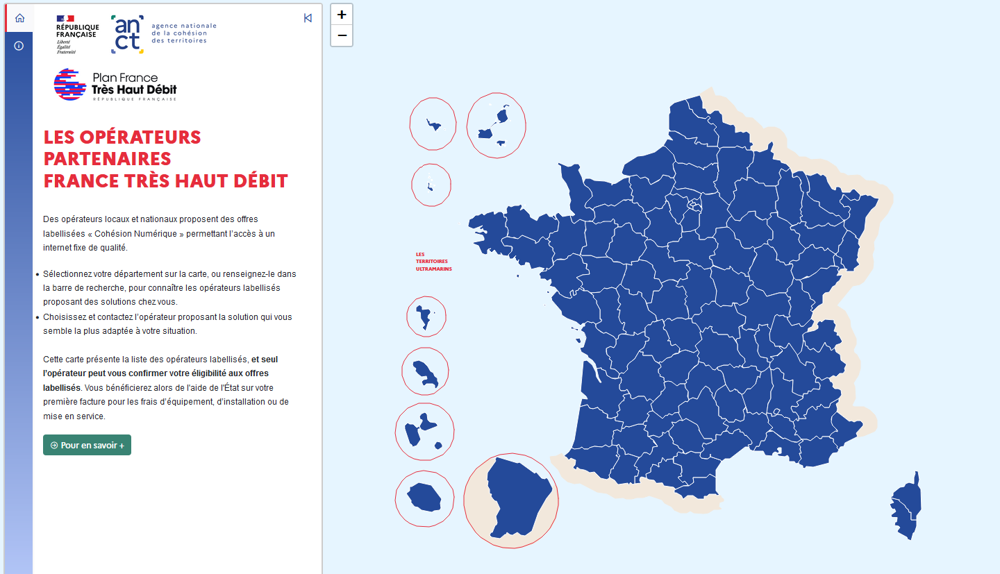

## Carte interactive des opérateurs France Très Haut Débit

Lien direct : https://carto.pages.sit.incubateur.tech/fthd_operateurs/

## Présentation

La carte interactive du programme France Très Haut Débit.

## Fonctionnalités 

- Rechercher les opérateurs partenaires du programme France Très Haut Débit par département

## Données et cartes

Lien pour visualiser et télécharger les cartes réalisées par l'ANCT : https://cartotheque.anct.gouv.fr/cartes 

## Technologies

Cet outil, conçu et développé par le service cartographie de l'ANCT, a été réalisé en HTML/CSS/Javascript et utilise les librairies Leaflet 1.9.4 et l'extension communautaire Leaflet Sidebar, Bootstrap 5.2.0, Line awesome. 

## En savoir plus sur l'ANCT

Page officielle : https://agence-cohesion-territoires.gouv.fr/  

## En savoir plus sur les programmes

Lien vers la page officiel du programme : https://agence-cohesion-territoires.gouv.fr/cohesion-numerique-des-territoires-1295#scrollNav-3 